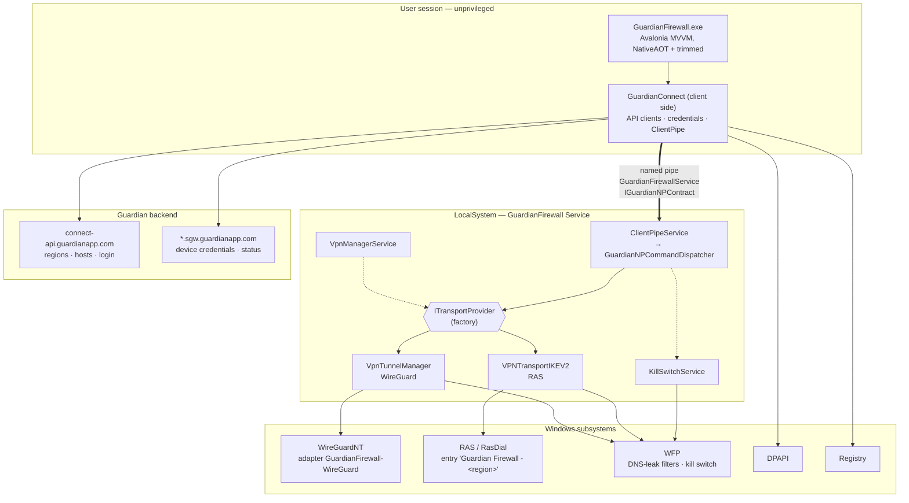
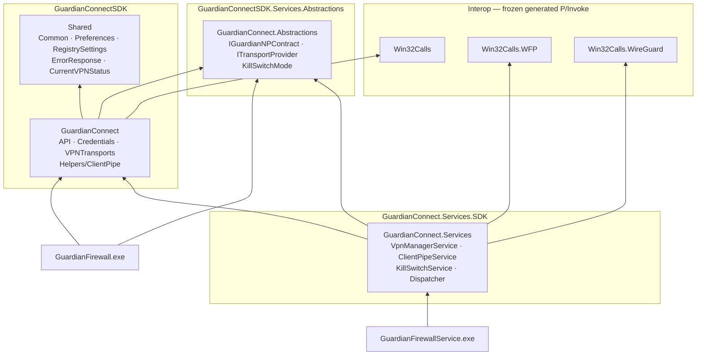
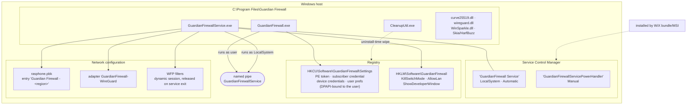

# Architecture Overview

How the Guardian Firewall Windows client is put together: which processes exist,
what runs at which privilege level, which assemblies live where, and what the
system touches on the machine and over the network.

Start here. For the connect path in detail, see
[`tunnel-creation-sequences.md`](./tunnel-creation-sequences.md).

## Source of truth

| Concern | Component | File |
|---|---|---|
| Service host (Windows service shell) | `MainService` | app repo `GuardianFirewallService/MainService.cs` |
| Service runtime | `VpnManagerService`, `ClientPipeService`, `KillSwitchService` | `GuardianConnect.Services/` |
| IPC contract | `IGuardianNPContract` | `GuardianConnect.Abstractions/IGuardianNPContract.cs` |
| IPC client / server | `ClientPipe` / `ClientPipeService` → `GuardianNPCommandDispatcher` | `GuardianConnect/Helpers/`, `GuardianConnect.Services/` |
| Transport abstraction | `ITransportProvider` | `GuardianConnect.Abstractions/ITransportProvider.cs` |
| WireGuard transport | `VpnTunnelManager` → `WireGuardTunnel` | `GuardianConnect.Services/`, `Win32Calls.WireGuard/` |
| IKEv2 transport | `VPNTransportIKEV2` → RAS | `GuardianConnect/VPNTransports/`, `Win32Calls/ConnectionRoutines.cs` |
| Backend API | `GRDHousekeepingAPI`, `GRDGateway`, `GRDServerManager` | `GuardianConnect/API/` |
| Credentials | `GRDCredentialManager`, `GRDKeychain`, `DPAPI` | `GuardianConnect/Credentials/`, `GuardianConnect/Win32/` |
| Settings | `RegistrySettings`, `Preferences` | `Shared/` |
| Client UI | Avalonia views + view models | app repo `GuardianFirewall/` |

## The one thing to know first

`GuardianFirewallService` in the app repo is a **shell** — a `ServiceBase` that
builds a generic host and registers three hosted services that all live in this
SDK. Service *behaviour* is documented here, not in the app repo.

```
MainService.OnStart()
  └── Host.CreateDefaultBuilder()
        ├── AddHostedService<VpnManagerService>()    // GuardianConnect.Services
        ├── AddHostedService<ClientPipeService>()    // GuardianConnect.Services
        └── AddHostedService<KillSwitchService>()    // GuardianConnect.Services
```

## Process and privilege split

Everything above the pipe runs unprivileged in the user's session. Everything
below it runs as LocalSystem and owns the tunnel, the firewall filters and the
network adapters.



Two things this diagram is making explicit:

**The pipe is the only channel** between the app and the service. It carries a
fixed command set (`IGuardianNPContract.NPCommands`), not arbitrary calls.

**Both transports run service-side behind one interface.**
`GuardianNPCommandDispatcher` selects an `ITransportProvider` implementation —
`VpnTunnelManager` for WireGuard, `VPNTransportIKEV2` for IKEv2 — from a single
factory. That factory is the primary extension seam: a new transport means
implementing one interface and adding one arm.

## Assembly and package dependencies

Three NuGet packages are published from this repo. The app consumes two of them
directly; the service host consumes the services package.



`Win32Calls` and `Win32Calls.WFP` are frozen generated P/Invoke — together
roughly 101,000 lines — and are deliberately opaque here. They appear in
diagrams only as a boundary; their contents are not documented and change only on
regeneration. The regeneration procedure lives in the app repo as
`CSWIN32-REGEN.md` (not linked — it is a different repository).

## Deployment

What exists on a machine after install, and who owns each piece.



Details worth carrying:

**Credentials are DPAPI-bound to the user account.** They live under `HKCU` and
can only be decrypted by the user who wrote them, in a logon session that has
their credentials. This is why anything running as a different user — or in a
network logon such as SSH public-key auth — cannot read them.

**WFP filters are session-scoped.** The filter engine session is opened with
`FWPM_SESSION_FLAG_DYNAMIC` (`Win32Calls.WFP/VpnUtils.cs`), so every filter the
service adds is owned by that session and released by WFP when the service
process exits. Filters do not survive a service restart, and a service restart is
therefore a valid recovery from a bad filter state.

**Two services are registered**, but only `GuardianFirewall Service` hosts the
runtime. The power-handler service is Manual and is not part of the connect path.

## Where to go next

| Topic | Document |
|---|---|
| Connect path, step by step | [`tunnel-creation-sequences.md`](./tunnel-creation-sequences.md) |
| Pipe protocol and command set | `ipc-contract.md` *(planned)* |
| The three hosted services, power and network events | `service-runtime.md` *(planned)* |
| Credentials, tokens, DPAPI | `credentials-and-identity.md` *(planned)* |
| Backend endpoints and host selection | `backend-api.md` *(planned)* |
| Transports and their state machines | `transports.md` *(planned)* |
| Kill switch and DNS-leak filters | `kill-switch-and-dns.md` *(planned)* |
