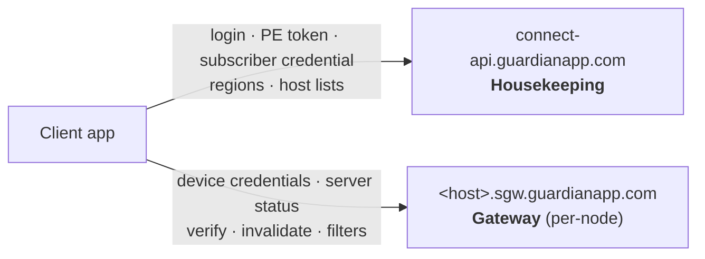
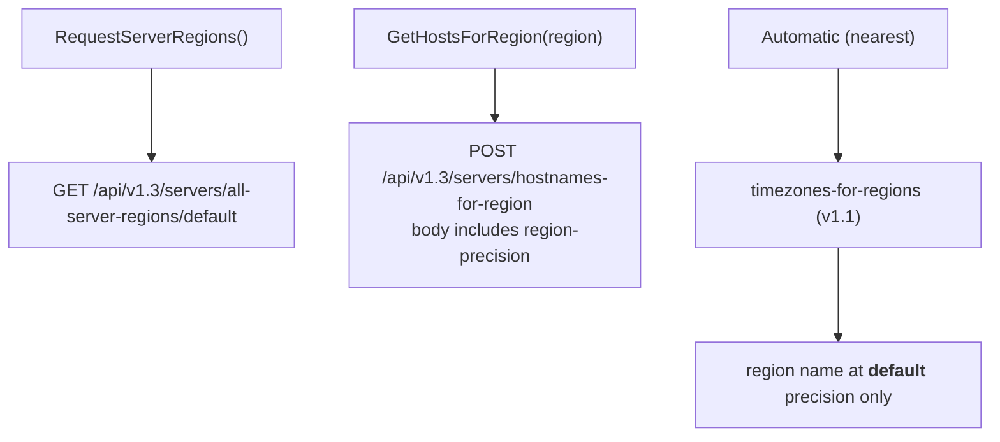
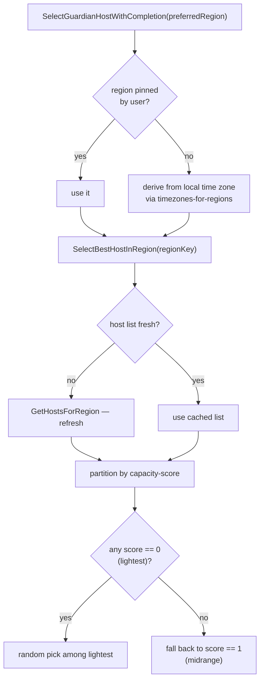

# Backend API

Two different backends, several API versions in play at once, and a host-selection
algorithm whose behaviour is not obvious from its name.

## Source of truth

| Concern | Component | File |
|---|---|---|
| Housekeeping API | `GRDHousekeepingAPI` | `GuardianConnect/API/GRDHousekeepingAPI.cs` |
| Gateway API | `GRDGateway` | `GuardianConnect/API/GRDGateway.cs` |
| Region + host selection | `GRDServerManager` | `GuardianConnect/API/GRDServerManager.cs` |
| Region cache | `GRDRegionCache` | `GuardianConnect/API/GRDRegionCache.cs` |
| Models | `GRDRegion`, `GRDSGWServer` | `GuardianConnect/API/`, `API/Model/` |
| Hostname + precision constants | `Common` | `Shared/Common.cs` |

## Two backends



**Housekeeping** is one well-known host that knows about accounts and the fleet.
**Gateway** calls go to the *specific node* the client intends to dial. That is
why a gateway call failing DNS names a node hostname — and why a node-named error
does not by itself imply the node is at fault.

## Endpoint surface

| Purpose | Method + path | Version |
|---|---|---|
| PE token info | `GET /api/v1/users/info-for-pe-token` | v1 |
| Subscriber credential | `POST /api/v1.2/subscriber-credential/create` | v1.2 |
| Time zones → regions | `GET /api/v1.1/servers/timezones-for-regions` | v1.1 |
| All regions | `GET /api/v1.3/servers/all-server-regions/{precision}` | **v1.3** |
| Hosts for region | `POST /api/v1.3/servers/hostnames-for-region` | **v1.3** |
| All hostnames | `GET /api/v1.1/servers/all-hostnames` | v1.1 |
| Server status | `GET /api/v1.3/server-status` | v1.3 (gateway) |
| Device credentials | `POST /api/v1.4/device-credentials` | **v1.4** (gateway) |
| Verify credentials | `POST /api/v1.4/device/{clientId}/verify-credentials` | v1.4 (gateway) |
| Invalidate credentials | `POST /api/v1.4/device/{clientId}/invalidate-credentials` | v1.4 (gateway) |
| Device filter config | `GET /api/v1.4/device/{clientId}/config/filters` | v1.4 |
| Partner/subscriber admin | `/api/v1.2/partners/...`, `/api/v1.3/partners/subscribers/new` | v1.2 / v1.3 |

Versions are per-endpoint, not global. `all-hostnames` is on v1.1 because that is
its latest; it is not lagging.

## Region precision

`all-server-regions` on v1.3 requires a precision as a **path segment** — a bare
URL 404s. Values: `default`, `country`, `city`, `city-by-country`.



The automatic path is pinned to `default` precision deliberately. Region names
returned by `timezones-for-regions` do not exist at `city` precision, so an
automatic selection resolved at city precision matches nothing.

A field difference that bites when adopting finer precision: at `city` precision
the region payload has **no `display-name` field** — the display string is
`name-pretty`. A model binding `display-name` falls back to raw region names such
as `us-sea` or `sa-scl` and shows those to users.

## Host selection



**Lower `capacity-score` is better.** `0` is "lightest" — the least loaded tier —
and `1` is midrange. Selection picks at **random within the best non-empty tier**,
not deterministically, so two consecutive connects in the same region routinely
land on different hosts. That is expected behaviour and not evidence of
instability.

> Note: the random pick is `lightest.ElementAt(Random.Shared.Next(lightest.Count() - 1))`.
> `Random.Shared.Next(n)` is exclusive of `n`, so the expression never selects the
> last element of the tier. With ten equal hosts, one is never chosen.

`GRDRegionCache` holds the region list in memory only — it is **not** persisted
across process restarts.

## Diagnosing from logs

Both call sites log the URL and body, so the served API version is visible:

```
RequestServerRegions: GET "https://connect-api.guardianapp.com/api/v1.3/servers/all-server-regions/default"
GetHostsForRegion: POST "https://connect-api.guardianapp.com/api/v1.3/servers/hostnames-for-region" "{...}"
EstablishWireGuardCredential: POST /api/v1.4/device-credentials transport=wireguard host="london-5.sgw..."
SelectBestHostInRegion: For region 'eu-en' we have 10 lightest hosts, 0 midrange hosts out of 10 total hosts
```

When a call fails with `No such host is known`, check whether **other** hostnames
resolve on that machine before suspecting the named host — a locally blocked
resolver produces `WSAHOST_NOT_FOUND`, which is indistinguishable from a genuinely
missing DNS record. See
[`kill-switch-and-dns.md`](./kill-switch-and-dns.md) *(planned)*.
