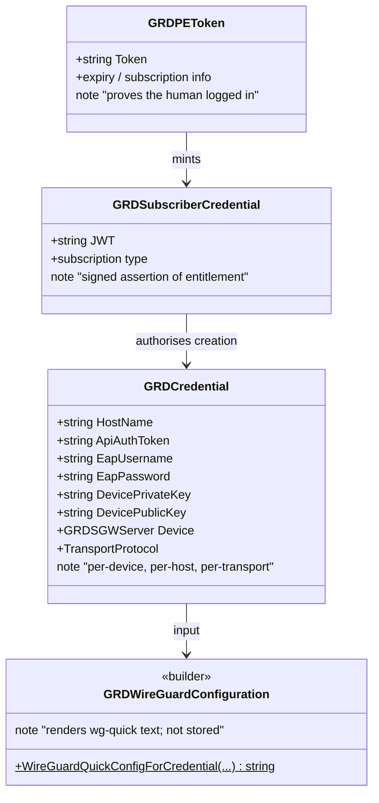
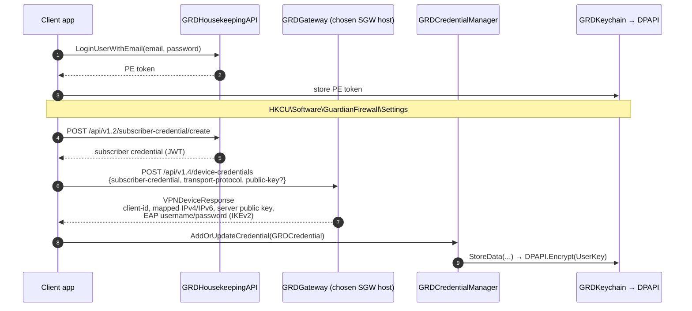
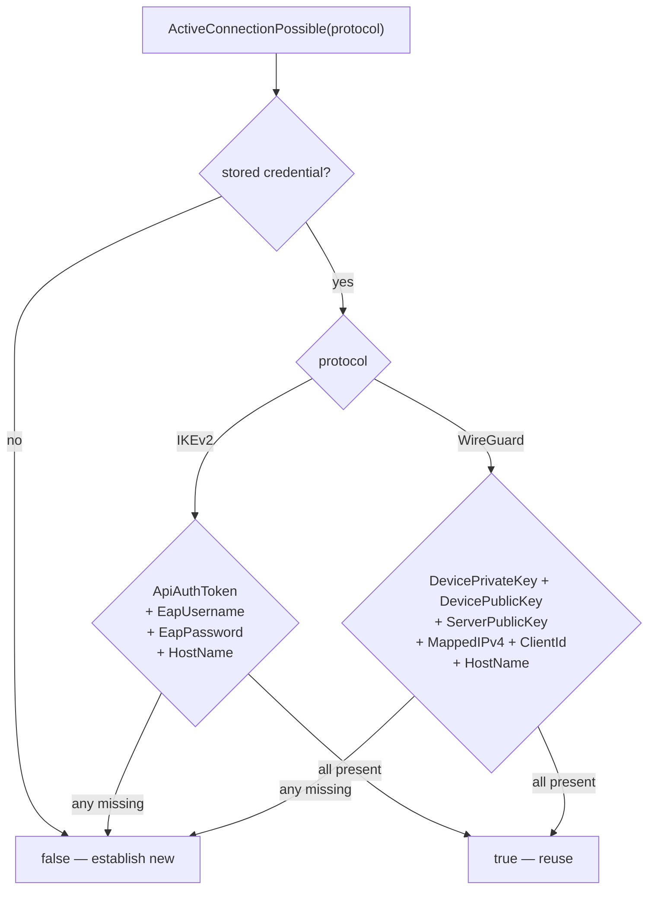
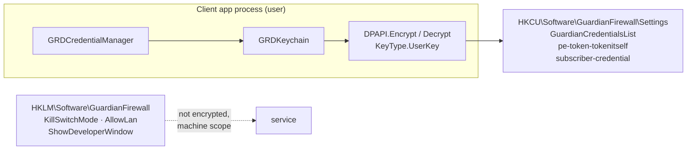

# Credentials and Identity

Four different things are called "credentials" in this codebase and they are not
interchangeable. This document separates them, shows how each is obtained, where
each is stored, and what invalidates it.

## Source of truth

| Concern | Component | File |
|---|---|---|
| Credential store | `GRDCredentialManager` | `GuardianConnect/Credentials/GRDCredentialManager.cs` |
| Encrypted storage | `GRDKeychain` / `IGRDKeychain` | `GuardianConnect/Credentials/GRDKeychain.cs` |
| Encryption | `DPAPI` | `GuardianConnect/Win32/DPAPI.cs` |
| Device credential | `GRDCredential`, `VPNDeviceResponse` | `GuardianConnect/Credentials/` |
| Subscriber credential | `GRDSubscriberCredential` | `GuardianConnect/Credentials/GRDSubscriberCredential.cs` |
| PE token | `GRDPEToken` | `GuardianConnect/Credentials/GRDPEToken.cs` |
| wg-quick builder | `GRDWireGuardConfiguration` | `GuardianConnect/Credentials/GRDWireGuardConfiguration.cs` |
| Registry paths | `RegistrySettings` | `Shared/RegistrySettings.cs` |

## The four artefacts

| Artefact | Answers | Lifetime |
|---|---|---|
| **PE token** | "which account is this?" | until logout or expiry |
| **Subscriber credential** | "is this account entitled?" | short-lived JWT, minted per need |
| **Device credential** | "how does this device dial this host?" | until invalidated or host/transport changes |
| **wg-quick config** | "what does WireGuardNT need right now?" | built per connect, never stored |

The device credential is the one people mean by "credentials" in bug reports. It
is bound to a **specific host** and a **specific transport**, which is why
switching either one invalidates it.

## Acquisition

WireGuard generates its keypair **client-side** and sends only the public key;
the private key never leaves the machine. IKEv2 receives EAP username/password
from the gateway. That asymmetry is why validity is checked per transport.

## Validity

`ActiveConnectionPossible(protocol)` is protocol-aware — a credential valid for
one transport is not valid for the other:

A historical trap worth knowing: `GRDCredential` stuffs backwards-compatible
`UserName`/`Password` values onto WireGuard credentials (`UserName = ClientId`,
`Password = "wireguard-creds"`). Before the transport switch began clearing
credentials unconditionally, that let `ActiveConnectionPossible(IKEv2)` return
true for a WireGuard credential — and the dispatcher would then feed those values
to `RasDial`, which returned `ERROR_AUTH_INTERNAL` (645).

## Storage and encryption

Everything persists under **`HKCU\Software\GuardianFirewall\Settings`**, encrypted
with DPAPI.

`DPAPI` supports `KeyType.UserKey` and `KeyType.MachineKey`; the default is
**`UserKey`**, and `CRYPTPROTECT_UI_FORBIDDEN` is always set so encryption never
prompts.

Two consequences that have already cost real debugging time:

**Only the same Windows user can decrypt.** Credentials written by one account
are unreadable by another. Anything running as a different user sees an empty or
failing store.

**The logon session must carry the user's credentials.** DPAPI unwraps the user's
master key from their password. A network-type logon that has no password
material — SSH **public-key** authentication is the common case — cannot decrypt,
and `CryptProtectData`/`CryptUnprotectData` fail with `Access is denied`. Running
a tool over SSH pubkey auth on a machine where the app works fine will still fail
here. Use an interactive session, or a logon created with credentials.

## Invalidation

| Trigger | Effect |
|---|---|
| Transport switch | credential cleared unconditionally, then re-established |
| Host or region change | new host means a new device credential |
| Reset Configuration | device registration cleared; region selection is **kept** (platform parity) |
| Clear PE Token (dev) | login cleared; device credential untouched |
| `invalidate-credentials` | gateway-side invalidation for that client id |

`Reset Configuration` deliberately does **not** reset the selected region — that
matches the other platforms.

## Endpoints involved

| Purpose | Endpoint |
|---|---|
| Login | `POST /api/v1/users/…` (housekeeping) |
| PE token info | `GET /api/v1/users/info-for-pe-token` |
| Subscriber credential | `POST /api/v1.2/subscriber-credential/create` |
| Device credential | `POST /api/v1.4/device-credentials` (gateway host) |
| Verify | `POST /api/v1.4/device/{clientId}/verify-credentials` |
| Invalidate | `POST /api/v1.4/device/{clientId}/invalidate-credentials` |

See [`backend-api.md`](./backend-api.md) for the full endpoint surface and
versioning.
