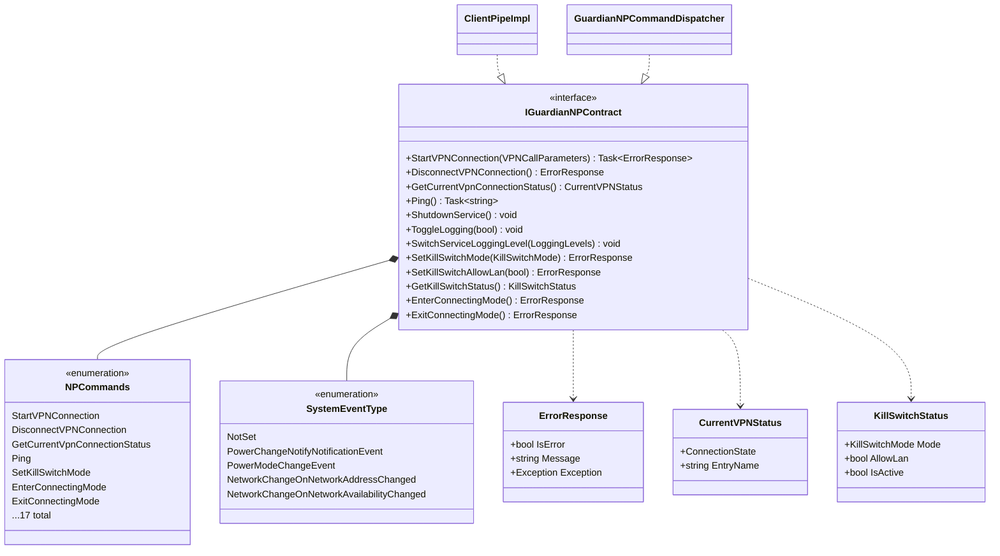
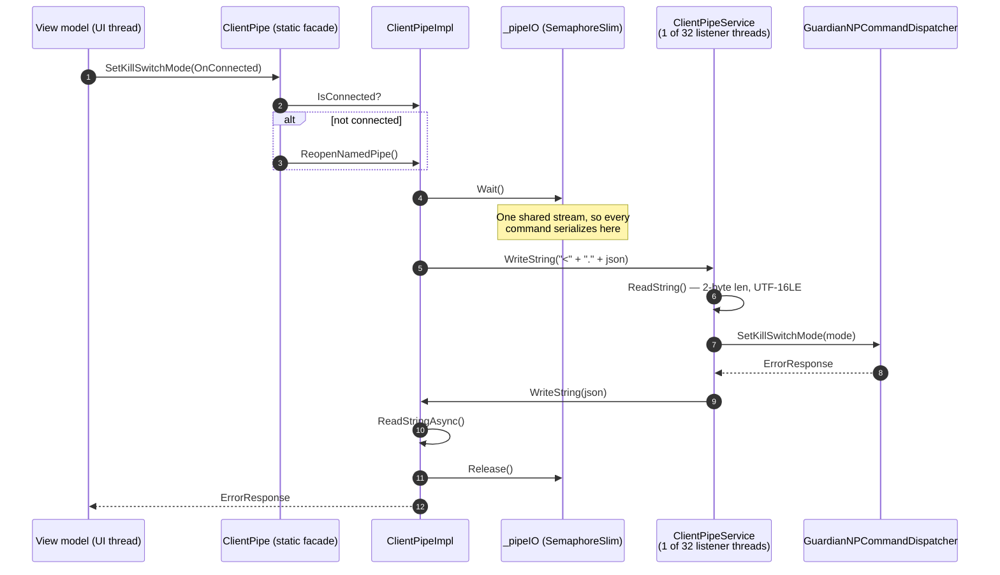

# IPC Contract — the app/service named pipe

The only channel between the unprivileged client app and the LocalSystem service.
Everything the UI can make the service do goes through this pipe, and the command
set is fixed.

See [`architecture-overview.md`](./architecture-overview.md) for where this sits
in the system.

## Source of truth

| Concern | Component | File |
|---|---|---|
| Command set + method signatures | `IGuardianNPContract` | `GuardianConnect.Abstractions/IGuardianNPContract.cs` |
| Wire framing | `StreamString` | `Shared/StreamString.cs` |
| Client side | `ClientPipe` / `ClientPipeImpl` | `GuardianConnect/Helpers/ClientPipe.cs` |
| Server side (listeners) | `ClientPipeService` | `GuardianConnect.Services/ClientPipeService.cs` |
| Server side (handlers) | `GuardianNPCommandDispatcher` | `GuardianConnect.Services/GuardianNPCommandDispatcher.cs` |
| Pipe name | `Common.kGRDServicePipeName` | `Shared/Common.cs` |

Pipe name: **`GuardianFirewallService`**.

## Wire format

Two layers. Framing first, then a command envelope inside it.

**Framing** (`StreamString`): a 2-byte big-endian length prefix followed by that
many bytes of **UTF-16LE** text. Maximum payload 65,535 bytes — `WriteString`
silently truncates anything larger.

```
+--------+--------+----------------------------+
| len hi | len lo | UTF-16LE payload (len bytes)|
+--------+--------+----------------------------+
```

**Envelope**: a single command character, a `.`, then a JSON payload.

```
<cmdChar> "." <json>
```

The command character is `(char)(command + '0')` — the enum ordinal offset from
ASCII `'0'`. Ordinals 0–9 map to digits; **10 and above run on into punctuation**,
which is why service logs show lines like `string from client: ;3.` rather than
something numeric.

| Ordinal | Char | Command | Returns |
|---:|:---:|---|---|
| 0 | `0` | `StartVPNConnection` | `ErrorResponse` |
| 1 | `1` | `DisconnectVPNConnection` | `ErrorResponse` |
| 2 | `2` | `GetCurrentVpnConnectionStatus` | `CurrentVPNStatus` |
| 3 | `3` | `GetData` | `string` |
| 4 | `4` | `GetDataUsingDataContract` | `CompositeType` (legacy) |
| 5 | `5` | `Ping` | `string` |
| 6 | `6` | `AdministrativeShutdownRequested` | void |
| 7 | `7` | `UninstallerShutdownOccurring` | void |
| 8 | `8` | `ToggleLogging` | void |
| 9 | `9` | `RequestLogLines` | log lines |
| 10 | `:` | `SwitchLoggingLevel` | void |
| 11 | `;` | `SendPowerAndNetworkEvents` | void |
| 12 | `<` | `SetKillSwitchMode` | `ErrorResponse` |
| 13 | `=` | `SetKillSwitchAllowLan` | `ErrorResponse` |
| 14 | `>` | `GetKillSwitchStatus` | `KillSwitchStatus` |
| 15 | `?` | `EnterConnectingMode` | `ErrorResponse` |
| 16 | `@` | `ExitConnectingMode` | `ErrorResponse` |

Adding a command means appending to the enum. **Inserting one renumbers every
command after it** and breaks any client/service pair built from different
versions of the contract.

## Contract types



Both ends implement the same interface — the client marshals onto the pipe, the
service executes. That is what keeps the two sides honest.

## A command, end to end



## Concurrency and timeouts

**Client: one stream, serialized.** `ClientPipeImpl` holds a single
`NamedPipeClientStream`, so every command takes `_pipeIO` (a `SemaphoreSlim`, not
a `lock`, because `StartVPNConnection` holds it across an `await`). Without it,
a UI-thread disconnect and a background status poll interleave their writes and
each thread consumes the other's response.

**Client: void commands time out at 10 s.** `ReadStringAsync` starts with two
*synchronous* `ReadByte()` calls for the length prefix, which block in `ReadFile`
with no timeout. If the service never answers — or framing desynced after an
overlapping command — that read hangs forever *and holds `_pipeIO`*, wedging every
later call. `EnterConnectingMode` is the first command in the Connect path, so an
unbounded hang there freezes the UI. The overlay commands are best-effort and
service-side idempotent, so degrading to a broken-pipe error is safe.

**Server: 32 listener threads.** `ClientPipeService` starts `numThreads = 32`
threads, each with its own `NamedPipeServerStream` instance, so multiple clients
(and the app's own concurrent callers) can be served without queueing behind one
another.

**Reconnect is implicit.** Every static entry point on `ClientPipe` checks
`IsConnected` and calls `ReopenNamedPipe()` before sending. There is no explicit
session; a dropped pipe heals on the next command.

## Framing failure mode worth knowing

`ReadStringAsync` uses `ReadExactlyAsync`, deliberately. A named-pipe `ReadAsync`
may return fewer bytes than requested; an earlier version ignored the returned
count and decoded the whole buffer anyway. Leftover bytes stayed in the pipe and
were then read as the next message's 2-byte length prefix, throwing framing off
**permanently** — UTF-16 decoding at an off-by-N offset yields garbled
high-codepoint text and absurd message lengths.

Short reads were rare with small IKEv2-era responses and became reliable once
WireGuard responses grew. If pipe traffic ever starts producing nonsense strings
or enormous declared lengths, suspect framing desync rather than the payload.

## Diagnosing from logs

Service-side lines name the command after decoding:

```
ClientPipeService[8]: string from client: ;3.
ClientPipeService[8]: Cmd=SendPowerAndNetworkEvents, payload='...
```

The bracketed number is the listener thread. `string from client` shows the raw
envelope — the leading character is the command, per the table above.
