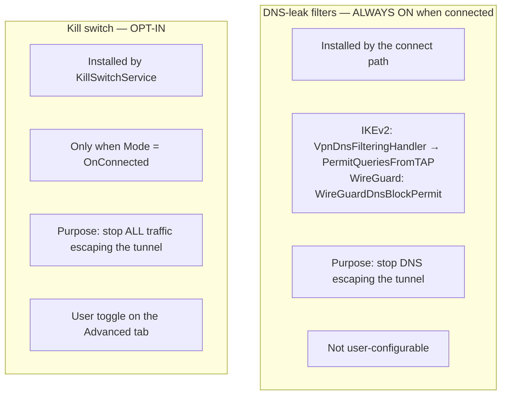
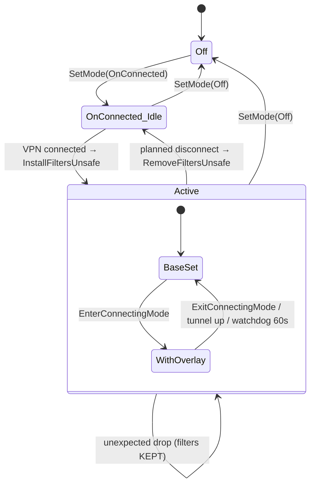
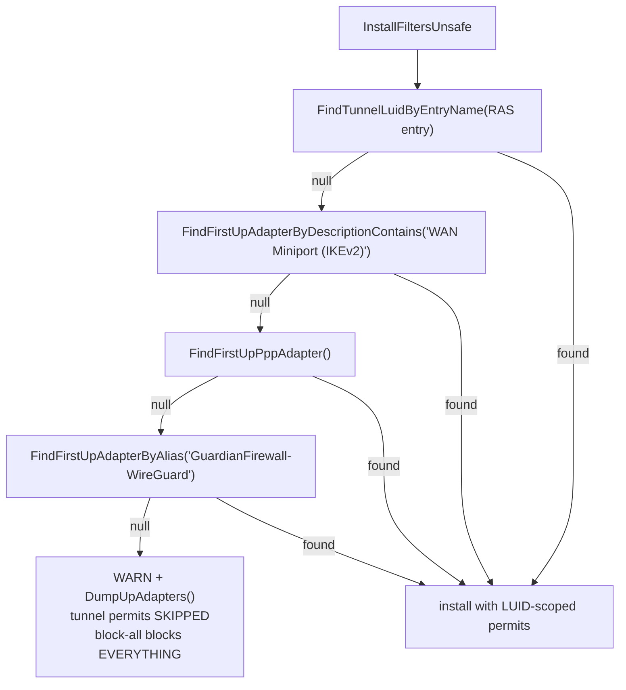

# Kill Switch and DNS Filters

Two independent WFP filter sets, installed by different code, for different
reasons, with different lifetimes. Conflating them is the single most common
mistake when reading logs from this area — including in past incident analysis.

## Source of truth

| Concern | Component | File |
|---|---|---|
| Kill switch (opt-in) | `KillSwitchService` | `GuardianConnect.Services/KillSwitchService.cs` |
| Kill-switch filter primitives | `KillSwitchFilters` | `Win32Calls.WFP/KillSwitchFilters.cs` |
| DNS-leak filters (IKEv2) | `VpnDnsFilteringHandler`, `VpnUtils` | `Win32Calls/VpnDnsFilteringHandler.cs`, `Win32Calls.WFP/VpnUtils.cs` |
| DNS-leak filters (WireGuard) | `WireGuardDnsBlockPermit` | `Win32Calls.WFP/` |
| Adapter LUID resolution | `AdapterLuidResolver` | `Win32Calls.WFP/` |
| Modes + status DTO | `KillSwitchMode`, `KillSwitchStatus` | `GuardianConnect.Abstractions/KillSwitchMode.cs` |

## The two filter sets



**A machine with the kill switch off still has DNS-leak filters installed while
connected.** If DNS breaks, the kill switch is not automatically the culprit —
check which set is present.

## Kill-switch modes

Only two modes ship. `KillSwitchMode` documents a third (always-on across reboots)
as explicitly not implemented.

| Mode | Meaning |
|---|---|
| `Off` (0) | No filters installed. Default. |
| `OnConnected` (1) | Filters active while connecting/connected/reconnecting. Removed on **user-initiated** disconnect; **kept across unexpected drops** so traffic stays blocked until the user reconnects or disables the kill switch. |

That second half of `OnConnected` is deliberate — an unexpected drop is exactly
when you do *not* want traffic falling back to the clear.



`Mode` and `AllowLan` persist in `HKLM\Software\GuardianFirewall` and are restored
on service start. **Filters themselves never persist** — see Lifetime below.

`AllowLan` is hardcoded `true` at startup, matching iOS/macOS's
`excludeLocalNetworks = YES`. There is no user-facing toggle; the IPC method is
still called so the filter set includes LAN permits.

## Filter weights

WFP resolves conflicts by weight within a sublayer. Four weights are in play:

| Weight | Filter | Effect |
|---:|---|---|
| 4 | `WeightSpecificPermit` | tunnel-LUID permits, WG carrier permit, connecting overlay |
| 3 | `WeightDnsBlock` | block DNS on non-tunnel interfaces |
| 2 | `WeightLanPermit` | permit local network |
| 1 | `WeightBlockAll` | block everything |

Read bottom-up: block everything, then carve out LAN, then block DNS anywhere
that isn't the tunnel, then permit the specific things that must always work.

## The connecting overlay

Registration must reach the backend *before* a tunnel exists. With the kill switch
already active — after an unexpected drop, say — DNS and HTTPS are blocked, so
registration cannot complete and the user is stuck.

`EnterConnectingMode` installs temporary permits at weight 4 — UDP/TCP port 53 and
TCP 443 outbound, unscoped — which beat the DNS-block (3) and block-all (1).

```mermaid
sequenceDiagram
    autonumber
    participant UI as Client app
    participant KS as KillSwitchService
    participant WFP

    UI->>KS: EnterConnectingMode (cmd '?')
    alt kill switch not active
        KS-->>UI: "KS not active; no overlay needed"
    else active
        KS->>WFP: install overlay permits (weight 4)
        KS->>KS: arm watchdog, deadline = now + 60s
    end
    UI->>UI: registration HTTP (DNS + 443 now possible)
    alt tunnel comes up
        KS->>KS: ReevaluateUnsafe → rebuild base set
        KS->>WFP: overlay removed (tunnel-LUID permits cover DNS)
    else client-side failure
        UI->>KS: ExitConnectingMode (cmd '@')  [prompt teardown]
    else client never answers
        KS->>KS: WatchdogFire after 60s → remove overlay
    end
```

Both commands are **idempotent**. A repeated `EnterConnectingMode` refreshes the
deadline rather than stacking overlays, which lets a client retry registration
within one connect session.

**Leak surface while the overlay is open:** DNS and HTTPS to any destination on
any local interface, bounded by registration duration (usually seconds) and capped
at 60 s by the watchdog. Non-DNS, non-443 traffic stays blocked by block-all. The
trade is deliberate: the user clicked Connect, so restoring connectivity is the
intent.

**The overlay is a no-op when the kill switch is not active** — which is the
common case on a clean connect, since `OnConnected` installs filters only once the
VPN is up. A log line reading `EnterConnectingMode: KS not active; no overlay
needed` means the whole path was inert, not that it failed.

## Tunnel LUID resolution

Filters that permit the tunnel are scoped to the tunnel adapter's LUID, so the
LUID must be resolved before install. Four strategies, in order:



The WireGuard alias is tried **last** so IKEv2 strategies keep priority when both
adapters briefly coexist during a transport switch.

If every strategy fails the service logs a warning, dumps all up adapters, and
installs the block-all set **without** tunnel permits — which blocks tunnel-bound
traffic too. That is a loud failure by design.

## Lifetime

Both filter sets are installed through a WFP session opened with
`FWPM_SESSION_FLAG_DYNAMIC` (`Win32Calls.WFP/VpnUtils.cs`). WFP owns them for the
life of that session and deletes them when it ends — i.e. when the service process
exits.

Consequences:

- Filters **never survive a service restart**.
- `Restart-Service 'GuardianFirewall Service'` is a valid recovery from any bad
  filter state. A reboot is not required.
- Equally: while the service stays alive, an orphaned filter set stays installed.
  Session scope bounds the damage to the process lifetime, nothing shorter.

## Failure mode: orphaned DNS-leak filters

If the tunnel goes away without the removal path running, the LUID-scoped permits
point at an adapter that no longer exists while the blocks remain. Every DNS query
from every process on the machine is dropped.

The resulting error is **indistinguishable from a nonexistent hostname**: a blocked
query yields no answer, `getaddrinfo` returns `WSAHOST_NOT_FOUND` (11001), and .NET
surfaces `HttpRequestException: No such host is known. (<host>:443)`. The message
names whatever host was being resolved, which reads as a gateway fault and is not
one.

Diagnostic rule: when a gateway hostname fails to resolve, check whether *other*
names — `connect-api.guardianapp.com`, or anything unrelated — resolve on the same
machine. If nothing resolves, suspect local filters, not the gateway.

This is reachable on IKEv2 today; see
[`service-runtime.md`](./service-runtime.md#known-fragility-ikev2-state-notification)
and the incident writeup `WorkProgression/Bug-IKEv2-DNS-Filters-Orphaned.md` in
the app repo. WireGuard is not affected — its teardown is driven by tunnel state
rather than RAS notifications.

## Ordering constraint

`NotificationHandler.WireGuardServerEndpoint` must be published **before**
`RaiseWireGuardConnectionStateChanged(true)`. `InstallFiltersUnsafe` runs
synchronously inside that fan-out and reads the endpoint to install the WireGuard
carrier permit — a UDP permit to exactly that server IP and port. Without it, the
kill switch blocks WireGuard's own encrypted carrier and all connectivity dies.
