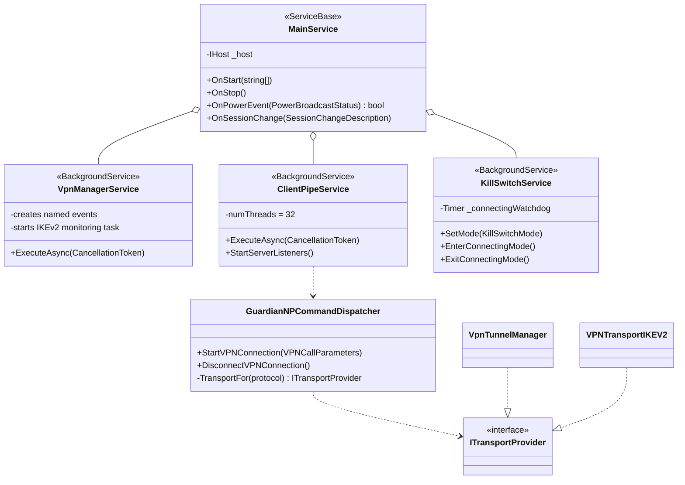
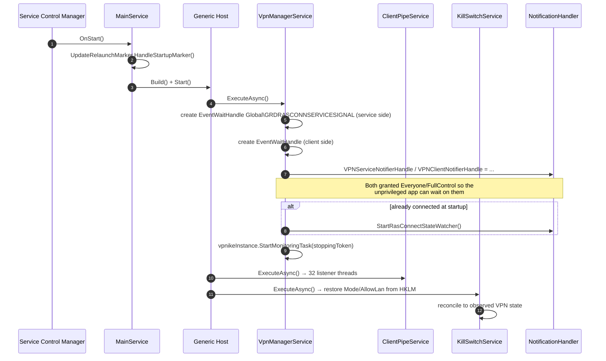
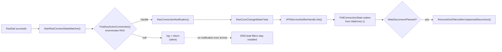

# Service Runtime

What the Windows service actually runs: three hosted services, the named events
that connect them to the transports, and how power and network changes reach the
tunnel.

See [`architecture-overview.md`](./architecture-overview.md) for the process
split and [`ipc-contract.md`](./ipc-contract.md) for the pipe itself.

## Source of truth

| Concern | Component | File |
|---|---|---|
| Service shell | `MainService` | app repo `GuardianFirewallService/MainService.cs` |
| Transport lifecycle + named events | `VpnManagerService` | `GuardianConnect.Services/VpnManagerService.cs` |
| Pipe listeners | `ClientPipeService` | `GuardianConnect.Services/ClientPipeService.cs` |
| WFP kill switch | `KillSwitchService` | `GuardianConnect.Services/KillSwitchService.cs` |
| Command handlers + transport factory | `GuardianNPCommandDispatcher` | `GuardianConnect.Services/GuardianNPCommandDispatcher.cs` |
| Power / network handling | `ServicePowerEventsHandler` | `GuardianConnect.Services/ServicePowerEventsHandler.cs` |
| RAS notification plumbing | `NotificationHandler` | `Win32Calls/NotificationHandler.cs` |

## Composition

The service project is a shell. `MainService.OnStart` builds a generic host and
registers three hosted services that all live in this SDK — that is the whole of
it, plus SCM plumbing and the in-place-update relaunch marker.



`GuardianNPCommandDispatcher` picks the transport from a single factory —
`VpnTunnelManager` for WireGuard, `VPNTransportIKEV2` for IKEv2. Both run
service-side. This is the extension seam for a new transport.

## Startup



Two details that matter:

**The named events are created here, not by the transports.**
`Global\GRDRASCONNSERVICESIGNAL` (service side) and its client-side counterpart
are created by `VpnManagerService` with an `Everyone`/`FullControl` ACL, because
the unprivileged app waits on the client-side one.

**The RAS watcher is only armed at startup if a connection already exists.**
Otherwise it is armed later, from the connect path. See "Known fragility" below.

**Kill-switch mode survives restarts.** `KillSwitchService` restores `Mode` and
`AllowLan` from `HKLM\Software\GuardianFirewall`, then reconciles to the observed
VPN state. Filters themselves do not survive — the WFP session is dynamic.

## The heartbeat loops

`VpnManagerService` and `ClientPipeService` both run the same shape: a
`while (!stoppingToken.IsCancellationRequested)` loop with `await Task.Delay(60000)`
that logs a heartbeat and does nothing else. `VpnManagerService`'s loop body is
literally a `// Do stuff with vpnManager here` comment.

These are the natural home for any periodic reconciliation the service needs —
they already exist, already have the cancellation token, and already run on the
right cadence.

## Power and network events

Events arrive by two routes. The client app is the primary source: it watches
`SystemEvents` and `NetworkChange` in the user session and forwards them over the
pipe. The SCM route is a fallback for when the pipe is down.

```mermaid
sequenceDiagram
    autonumber
    participant OS as Windows
    participant App as Client app
    participant Pipe as ClientPipeService
    participant SPE as ServicePowerEventsHandler
    participant IKE as VPNTransportIKEV2

    rect rgb(240,244,250)
    Note over App,SPE: Primary route — via the pipe
    OS->>App: SystemEvents / NetworkChange
    App->>Pipe: SendPowerAndNetworkEvents (cmd ';')
    Pipe->>SPE: HandleSystemEventsFromclient(type, payload)
    end

    rect rgb(250,246,240)
    Note over OS,SPE: Fallback route — via the SCM
    OS->>SPE: MainService.OnPowerEvent(status)
    SPE->>SPE: HandleScmPowerEvent(status)
    end

    alt suspend
        SPE->>IKE: PowerSuspendVPNConnection(...)
        SPE->>SPE: record VPNStatusAtSuspendTime
    else resume
        SPE->>SPE: PerformResumeActions()
        SPE->>IKE: PowerResumeVPNConnection() (retried)
    end
```

`SystemEventType` values carried over the pipe:
`PowerChangeNotifyNotificationEvent`, `PowerModeChangeEvent`,
`NetworkChangeOnNetworkAddressChanged`, `NetworkChangeOnNetworkAvailabilityChanged`.

`ServicePowerEventsHandler` wires itself into the IKEv2 transport by assigning
static delegates at startup (`VPNTransportIKEV2.PowerResumeActions`,
`SetVPNStateAtSuspend`, `ResetVPNStateAtSuspend`) rather than by subscription.

## Known fragility: IKEv2 state notification

The IKEv2 transport learns about connection state through a chain that is
entirely edge-triggered:



`PollConnectionState` does not poll despite its name — it blocks on
`WaitOne(-1)` for the named event. `RasConnChangeWaiterTask` is the only thing
that signals it, and the watcher is one-shot per arm.

If `FindAnyActiveConnection()` returns null — the RAS connection has not appeared
yet, or has already gone — the watcher never arms, no edge ever occurs, and the
DNS-leak filters installed by the connect path are never removed. WFP's dynamic
session releases them only when the service process exits.

WireGuard does not use this path. `VpnTunnelManager` publishes tunnel state
directly and deliberately does not fire `VPNServiceNotifierHandle`; see the
comment at `VpnTunnelManager.cs:160`.

This is a known defect, documented with log evidence in the app repo as
`WorkProgression/Bug-IKEv2-DNS-Filters-Orphaned.md`.
