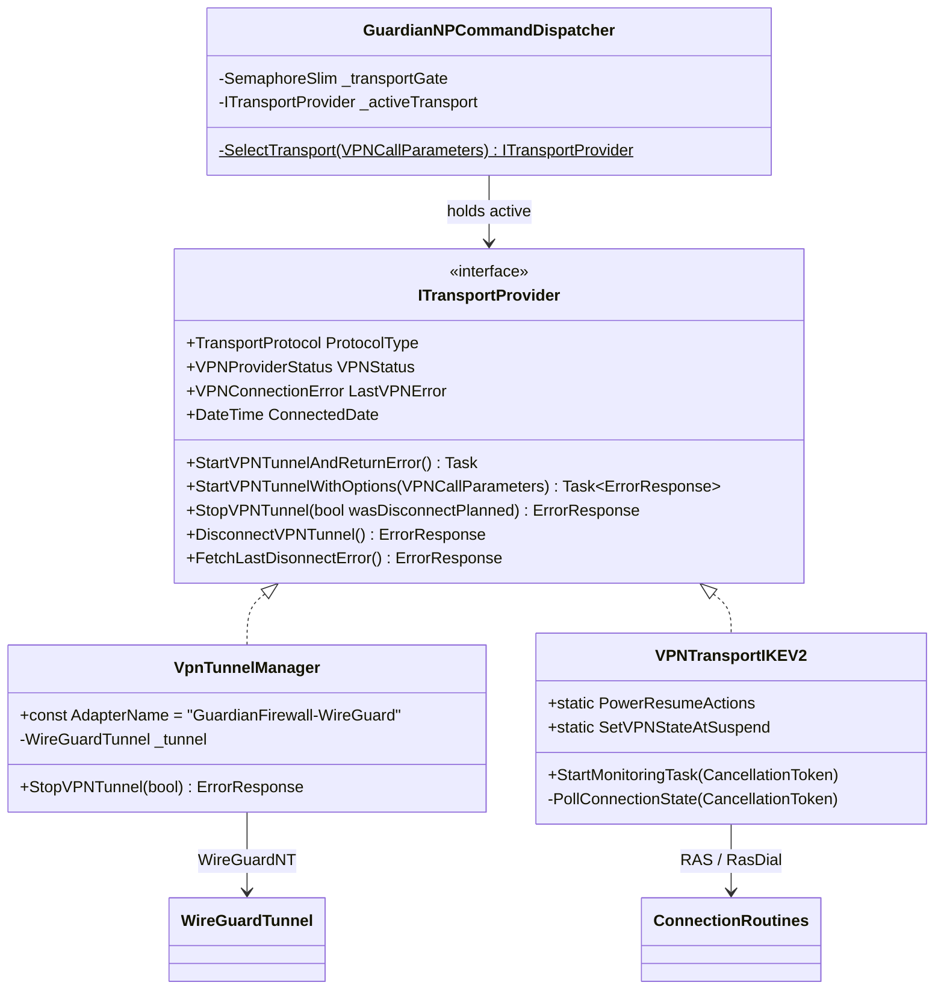
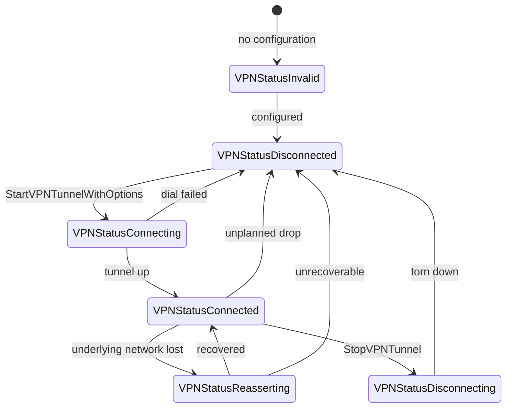
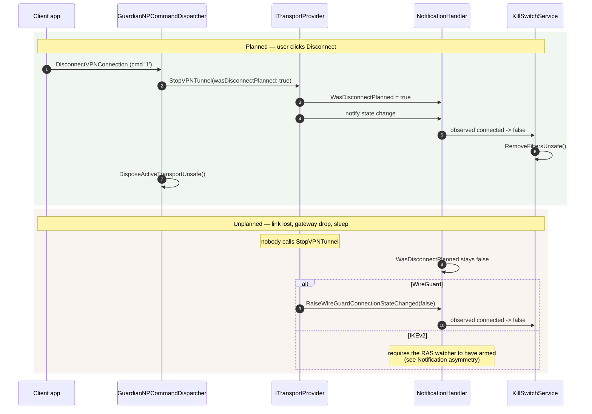

# Transports

How a tunnel is actually established and torn down, and how the two transports
differ. Both run service-side behind one interface; almost everything else about
them is different.

Connect is covered step by step in
[`tunnel-creation-sequences.md`](./tunnel-creation-sequences.md). This document
covers the abstraction, selection, teardown, state, and the notification
asymmetry between the two implementations.

## Source of truth

| Concern | Component | File |
|---|---|---|
| Interface + status/error enums | `ITransportProvider` | `GuardianConnect.Abstractions/ITransportProvider.cs` |
| Selection | `GuardianNPCommandDispatcher.SelectTransport` | `GuardianConnect.Services/GuardianNPCommandDispatcher.cs` |
| WireGuard | `VpnTunnelManager` | `GuardianConnect.Services/VpnTunnelManager.cs` |
| WireGuardNT interop | `WireGuardTunnel`, `WireGuardInterop` | `Win32Calls.WireGuard/` |
| IKEv2 | `VPNTransportIKEV2` | `GuardianConnect/VPNTransports/VPNTransportIKEV2.cs` |
| RAS interop | `ConnectionRoutines` | `Win32Calls/ConnectionRoutines.cs` |
| State fan-out | `NotificationHandler` | `Win32Calls/NotificationHandler.cs` |

## The abstraction



`VPNProviderStatus` and `VPNConnectionError` mirror Apple's `NEVPNStatus` and
`NEVPNConnectionError` — same names, same ordinals, and the doc comments in the
interface are carried over from the Apple headers. That is deliberate: it keeps
status vocabulary aligned across platforms.

## Selection

The transport is chosen explicitly from `VPNCallParameters.Transport` and is
**never inferred**:

```csharp
private static ITransportProvider? SelectTransport(VPNCallParameters request) =>
    request.Transport switch
    {
        TransportProtocol.TransportWireGuard => new VpnTunnelManager(),
        TransportProtocol.TransportIKEv2     => new VPNTransportIKEV2(),
        _                                    => null,
    };
```

`TransportUnknown` returns `null` so the dispatcher refuses the request rather
than defaulting. A wrong default would leave the host in a confusing state — an
IKEv2 tunnel when WireGuard was intended — which is worse than a clean error.

`_transportGate` (a `SemaphoreSlim`) serializes start and stop so a disconnect
cannot race a connect. On a failed start the dispatcher drops its reference,
because `VpnTunnelManager` disposes its own tunnel on the error path and a
follow-up disconnect would otherwise use a dead instance.

**Adding a transport** = implement `ITransportProvider` + add one `switch` arm.

## Connection state



The transition that carries the most weight is the last one. Whether a move to
`VPNStatusDisconnected` was *planned* is not derivable from the state itself — it
is carried out of band in `NotificationHandler.WasDisconnectPlanned`, set by
whoever initiated the teardown. Cleanup paths branch on that flag, so a state
change alone is not enough to know what to do.

## Disconnect



If the dispatcher has no active transport — a fresh service cleaning up after an
ungraceful client exit — `DisconnectVPNConnection` constructs a bare
`VPNTransportIKEV2` and calls `StopVPNTunnel()` on it, which can still find and
tear down an existing RAS connection.

## Notification asymmetry

This is the most important structural difference between the two transports.

| | WireGuard | IKEv2 |
|---|---|---|
| Tunnel owner | the service (WireGuardNT) | the OS (RAS) |
| State discovery | direct — the tunnel object is ours | indirect — must ask RAS |
| Signals `VPNClientNotifierHandle` | yes | yes (via RAS watcher) |
| Signals `VPNServiceNotifierHandle` | **no, deliberately** | yes |
| Unplanned-drop detection | inherent | depends on the watcher arming |

`VpnTunnelManager` explicitly does **not** fire `VPNServiceNotifierHandle`
(`VpnTunnelManager.cs:160`). Its only listener is the IKEv2 `PollConnectionState`
loop, which would then query RAS, find no RAS connection up, and mislabel a
healthy WireGuard session as an unplanned IKEv2 disconnect — corrupting
`VPNStatusAtSuspendTime`. WireGuard state reaches the client through
`VPNClientNotifierHandle` alone.

Conversely, WireGuard *must* fire the client handle. Without it the app's
`GeneralPageViewModel` waits on `VPNEVT_NAME_CLIENTSIDE` forever and the Connect
button never flips to "Disconnect" — WireGuard has no RAS path to get that for
free.

For the IKEv2 side of this — and the failure mode when the watcher never arms —
see [`service-runtime.md`](./service-runtime.md#known-fragility-ikev2-state-notification).

## Ordering constraints

Two orderings in `VpnTunnelManager` are load-bearing and easy to break:

**Publish the server endpoint before raising the connected event.**
`KillSwitchService.InstallFiltersUnsafe` runs *synchronously* inside the
`RaiseWireGuardConnectionStateChanged` fan-out and reads
`NotificationHandler.WireGuardServerEndpoint` to install the carrier permit — a
UDP permit to exactly that server IP and port. If the endpoint is not set first,
the kill switch blocks WireGuard's own encrypted carrier and all connectivity
dies.

**Set `WasDisconnectPlanned` before signalling.** Subscribers read it during the
fan-out, not after.

## Errors

`VPNConnectionError` carries 19 values inherited from Apple's
`NEVPNConnectionError`, covering configuration, name resolution, server
reachability, certificate validity and negotiation failure. The transports set
`LastVPNError`; `FetchLastDisonnectError()` retrieves the most recent cause.

Note that RAS numeric errors are not the same vocabulary. RAS returns its own
codes from `RasDial` — for example `13868` (`POLICY_MATCH`), which indicates an
IPsec policy mismatch rather than the bad-certificate reading it is easily
confused with.
