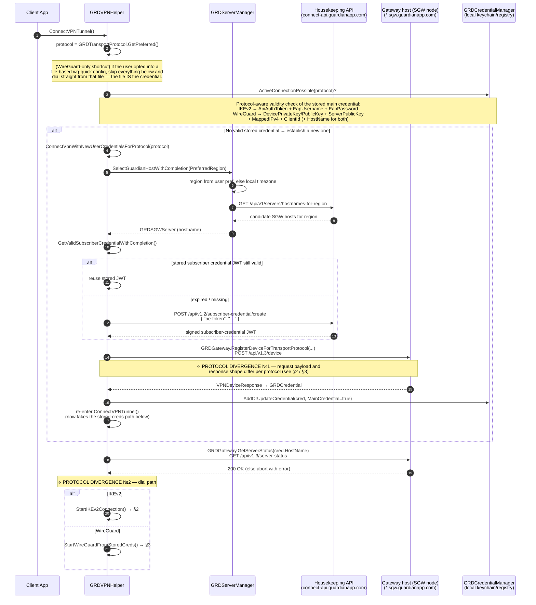
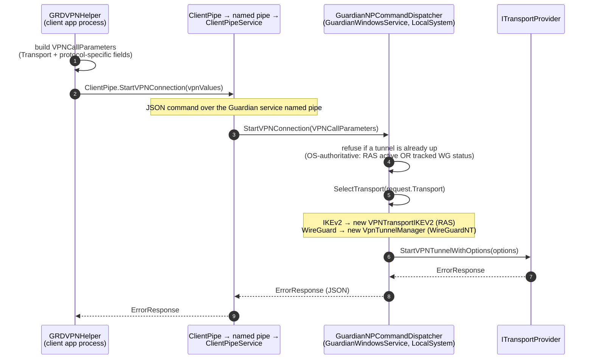
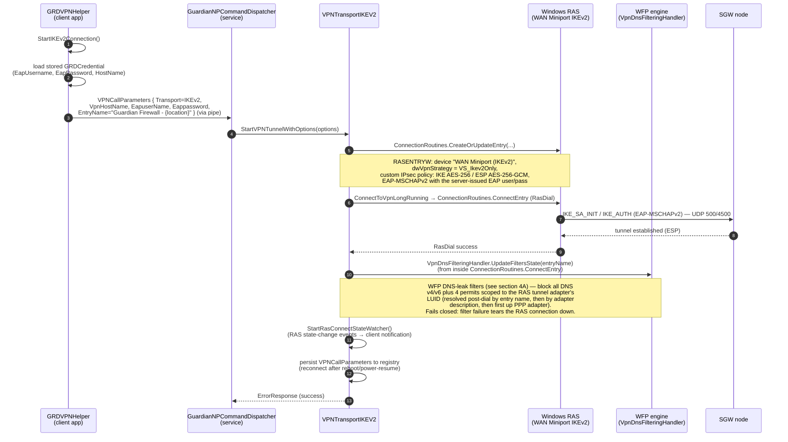
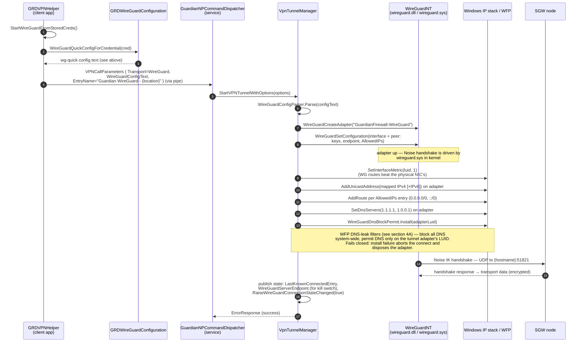

# VPN Tunnel Creation — Sequence Diagrams

How the GuardianConnect Windows SDK establishes a VPN tunnel, from the public entry
point down to the OS. There is one **common path** (entry point → credential
establishment → dispatch to the Windows service), then a **protocol-specific
divergence** for IKEv2 and WireGuard.

Source of truth for this document (SDK branch `inplace-update`):

| Layer | Component | File |
|---|---|---|
| Entry point / orchestration | `GRDVPNHelper` | `GuardianConnect/Helpers/GRDVPNHelper.cs` |
| Backend API (gateway host) | `GRDGateway` | `GuardianConnect/API/GRDGateway.cs` |
| Backend API (housekeeping) | `GRDHousekeepingAPI` | `GuardianConnect/API/GRDHousekeepingAPI.cs` |
| Host selection | `GRDServerManager` | `GuardianConnect/API/GRDServerManager.cs` |
| wg-quick config builder | `GRDWireGuardConfiguration` | `GuardianConnect/Credentials/GRDWireGuardConfiguration.cs` |
| IPC client (app side) | `ClientPipe` | `GuardianConnect/Helpers/ClientPipe.cs` |
| IPC server (service side) | `ClientPipeService` → `GuardianNPCommandDispatcher` | `GuardianConnect.Services/` |
| IKEv2 transport | `VPNTransportIKEV2` (RAS/RasDial) | `GuardianConnect/VPNTransports/VPNTransportIKEV2.cs` |
| WireGuard transport | `VpnTunnelManager` (WireGuardNT) | `GuardianConnect.Services/VpnTunnelManager.cs` |
| WireGuardNT interop | `WireGuardTunnel` / `WireGuardInterop` | `Win32Calls.WireGuard/` |
| WFP DNS-leak filters | `VpnUtils` / `TunnelDnsPermit` / `WireGuardDnsBlockPermit` | `Win32Calls.WFP/`, `Win32Calls/VpnDnsFilteringHandler.cs` |
| WFP kill switch (opt-in) | `KillSwitchService` / `KillSwitchFilters` | `GuardianConnect.Services/`, `Win32Calls.WFP/` |

Process split: everything above the pipe runs in the **client app process**
(unprivileged). Everything below the pipe runs in **GuardianWindowsService**
(LocalSystem), which owns the actual tunnel.

---

## 1. Common path — `ConnectVPNTunnel()`

Entry point: `GRDVPNHelper.ConnectVPNTunnel()`. It resolves the preferred
transport protocol, establishes credentials if none are stored (the *key
exchange* — this is where each protocol shapes its own request/response),
pre-flights the chosen gateway host, then hands off to the protocol-specific
dial path.



Both dial paths converge on the same IPC hop into the Windows service:



---

## 2. IKEv2 divergence

**Key exchange (divergence №1):** the register-device call sends no key
material; the *server generates* EAP credentials and returns them.

`POST https://{sgw-host}/api/v1.3/device`

```json
{
  "subscriber-credential": "<JWT>",
  "transport-protocol": "ikev2"
}
```

Response (fields used): `eap-username`, `eap-password`, `api-auth-token`.
`ClientId` is set to the EAP username.

**Dial (divergence №2):** the service creates a RAS phonebook entry and dials
it with `RasDial` — Windows' built-in IKEv2 stack does the actual IKE/IPsec
negotiation.



Notes:
- Routing: RAS handles routes and interface metrics itself as part of the
  PPP/IKEv2 connection; the SDK does not program routes on this path.
- DNS-leak protection is NOT free on this path either — the SDK installs the
  same WFP block/permit filter set as WireGuard, just triggered from inside
  `ConnectionRoutines.ConnectEntry` after the dial succeeds. See §4A for the
  full comparison.
- The service watches RAS connection-state events to detect unplanned drops
  and to support power suspend/resume reconnection. On an *unplanned* drop it
  runs `RemoveDnsFiltersAfterUnplannedDisconnect()` — orphaned LUID-scoped DNS
  filters pinned to a dead tunnel adapter would otherwise block all DNS on the
  machine until reboot.

---

## 3. WireGuard divergence

**Key exchange (divergence №1):** the *client generates* a Curve25519 keypair;
only the public key is sent. The server responds with its own public key and
the client's assigned tunnel IP. This is the section relevant to an
independent implementation talking to the same backend.

`POST https://{sgw-host}/api/v1.3/device`

```json
{
  "subscriber-credential": "<JWT>",
  "transport-protocol": "wireguard",
  "public-key": "<client Curve25519 public key, base64>"
}
```

Response (required fields): `server-public-key`, `mapped-ipv4-address`,
`client-id`, `api-auth-token`; optional `mapped-ipv6-address`. The client's
private key never leaves the device.

From the stored credential the SDK renders a standard **wg-quick** config:

```ini
[Interface]
PrivateKey = <device private key, base64>
Address = <mapped-ipv4-address>[, <mapped-ipv6-address>]
DNS = 1.1.1.1, 1.0.0.1          ; default, overridable via preferredDNSServers

[Peer]
PublicKey = <server-public-key>
AllowedIPs = 0.0.0.0/0, ::/0
Endpoint = <sgw-hostname>:51821
```

The WireGuard data-plane port on Guardian SGW nodes is **UDP 51821**.

**Dial (divergence №2):** the service drives a WireGuardNT (`wireguard.sys`)
adapter directly via `wireguard.dll`, then programs IP/routes/DNS itself
(WireGuardNT does none of that for you — that's normally wg-quick's job).



Failure handling on the WG path: if any step after adapter creation throws
(address/route/DNS programming, WFP filter install), the adapter is disposed —
which sweeps away all partial IP/route/DNS state — and the error is returned
up the pipe.

Teardown (for completeness): uninstall the WFP DNS filters, dispose the
adapter, flush the Windows DNS resolver cache (`DnsFlushResolverCache`) so a
rapid reconnect to a different SGW host doesn't hit stale/negative entries
resolved while `1.1.1.1` was the active resolver.

---

## 4. WFP filtering — what each protocol installs and why

The SDK touches the Windows Filtering Platform in two independent layers.
Layer A is always-on and part of every tunnel bring-up; layer B is an opt-in
user feature. They live in different sublayers and don't interact.

### 4A. DNS-leak filters (always-on, both protocols)

**Why they exist at all:** Windows "smart multi-homed name resolution" races
DNS queries out *all* interfaces in parallel. With a tunnel up and tunnel DNS
configured, queries still leave the physical NIC to the ISP's resolvers —
a full DNS leak — unless something blocks them. Setting DNS on the tunnel
adapter is not enough on Windows.

**The filter set is identical for both protocols** (shared sublayer GUID
`754b7cbd-cad3-474e-8d2c-054413fd4509`, shared `TunnelDnsPermit` primitives):

- 2 × **block**: outbound remote-port-53 at `ALE_AUTH_CONNECT_V4` and `_V6`
  (one condition: port).
- 4 × **permit**: UDP/TCP × v4/v6, three conditions each —
  `IP_PROTOCOL` + `IP_REMOTE_PORT = 53` + `IP_LOCAL_INTERFACE = <tunnel LUID>`.
- Both at default weight: WFP arbitration prefers the more-specific
  (3-condition) permit over the less-specific (1-condition) block, so DNS
  flows **only** on the tunnel adapter.
- Installed in a **dynamic** WFP session (`FWPM_SESSION_FLAG_DYNAMIC`) — if
  the service process dies, WFP removes the filters automatically, so a crash
  can't leave the machine permanently DNS-blackholed.

**Where the two protocols differ** is only in plumbing, not in filter shape:

| | IKEv2 | WireGuard |
|---|---|---|
| Install point | `VpnUtils.AddWpmFilters` via `VpnDnsFilteringHandler.UpdateFiltersState`, called from `ConnectionRoutines.ConnectEntry` immediately after `RasDial` succeeds | `WireGuardDnsBlockPermit.Install`, called inline in `VpnTunnelManager.StartVPNTunnelWithOptions` after IP/route/DNS programming, before the tunnel is reported connected |
| Tunnel LUID | Must be *discovered* after the dial — RAS owns the adapter. Resolution ladder: RAS entry name → adapter description contains "WAN Miniport (IKEv2)" → first up PPP adapter | Known exactly — returned by `WireGuardCreateAdapter`, no discovery needed |
| Install failure | Fail closed: filters removed and the RAS connection is hung up | Fail closed: connect aborted, adapter disposed |
| Teardown | Planned: `DisconnectEntryAndRemove` → `UpdateFiltersState` removes filters. Unplanned drop (network loss, sleep): `RemoveDnsFiltersAfterUnplannedDisconnect` reconciles, since orphaned filters pinned to a dead LUID block ALL DNS until reboot | `StopVPNTunnel` uninstalls the filters *before* disposing the adapter, so the permits never reference a vanished LUID |
| Bookkeeping | Static filter IDs in `VpnUtils` + a `FiltersInstalled` registry flag | Per-tunnel `Installation` handle (engine + filter-ID list) returned to the caller |

**Historical note** (explains why the code paths look asymmetric): the IKEv2
permits were originally *unscoped* — they permitted everything at the layer,
so the WFP pipeline contributed zero leak protection. IKEv2 stayed leak-free
anyway because a RAS PPP connection raises the physical NIC's interface
metric (~4245), which makes the multi-homed resolver skip it. Wintun /
WireGuardNT has no such side effect, so the WireGuard port required genuine
LUID-scoped permits — and the IKEv2 path was then upgraded to the same
`TunnelDnsPermit` primitives. Today both protocols get real, LUID-scoped
enforcement — but note the metric side effect means IKEv2 has two layers of
protection while WireGuard's WFP filters are its *only* one. An independent
WireGuard implementation must replicate this (or an equivalent firewall rule)
to be leak-free on Windows.

### 4B. Kill switch (opt-in, both protocols, different carrier permits)

Separate feature (`KillSwitchService` + `KillSwitchFilters`, its own
sublayer), active only when the user enables it: **block all** v4/v6 traffic,
then punch permits for loopback, DHCP, optionally LAN subnets, everything on
the tunnel adapter's LUID (both directions, both families), and DNS on the
tunnel LUID.

The one *protocol-specific* part is the **carrier permit** — the tunnel's own
encrypted traffic leaves on the *physical* NIC and would be killed by
block-all, and each protocol's carrier looks different on the wire:

- **IKEv2**: permit by protocol identity — IKE UDP/500, NAT-T UDP/4500,
  ESP (IP proto 50), IP-in-IP (IP proto 4). These protocol numbers *are* the
  VPN; nothing else uses them, so no destination scoping is needed.
- **WireGuard**: the carrier is generic UDP on an arbitrary port —
  permitting "all UDP" would be a huge leak hole. Instead the permit is
  scoped to **exactly the server endpoint** (`UDP → serverIP:51821`), which
  `VpnTunnelManager` publishes (`NotificationHandler.WireGuardServerEndpoint`)
  *before* raising the connected event, because the kill switch installs its
  filters synchronously inside that event fan-out. Zero leak surface.

Adapter identification differs the same way as in 4A: the kill switch finds
the WG adapter by its deterministic alias `GuardianFirewall-WireGuard`, and
the IKEv2 adapter via RAS description / PPP heuristics.

---

## 5. Backend contract cheat-sheet (for an independent WireGuard client)

The minimum an external service needs to reproduce the SDK's WireGuard flow
against Guardian backend VPN hosts:

| # | Step | Call | Notes |
|---|---|---|---|
| 1 | Auth | `POST https://connect-api.guardianapp.com/api/v1.2/subscriber-credential/create` with `{"pe-token": …}` | Returns a signed subscriber-credential JWT. Reuse until expiry. |
| 2 | Pick host | `GET https://connect-api.guardianapp.com/api/v1/servers/hostnames-for-region` | Or any other means of choosing an SGW hostname. |
| 3 | Keygen | Curve25519 keypair, client-side | Private key never leaves the device. |
| 4 | Register | `POST https://{sgw-host}/api/v1.3/device` with `subscriber-credential`, `transport-protocol: "wireguard"`, `public-key` (base64) | Response: `server-public-key`, `mapped-ipv4-address` (+ optional `mapped-ipv6-address`), `client-id`, `api-auth-token`. |
| 5 | (optional) Pre-flight | `GET https://{sgw-host}/api/v1.3/server-status` | SDK does this before every dial with stored creds. |
| 6 | Tunnel | Standard WireGuard to `{sgw-host}:51821/udp` | Interface = mapped address(es); Peer = server public key; `AllowedIPs = 0.0.0.0/0, ::/0`; DNS of your choosing (SDK defaults to 1.1.1.1, 1.0.0.1). |
| 7 | Invalidate (on logout/protocol switch) | `POST https://{sgw-host}/api/v1.3/device/{client-id}/invalidate-credentials` with `api-auth-token` + subscriber JWT | Keeps the host from accumulating dead peers. |

Platform details worth copying even in a non-Windows-RAS implementation:
pin the tunnel interface metric below the physical NIC's, add one route per
`AllowedIPs` entry, set DNS on the tunnel adapter only, and add explicit
DNS-leak protection — Windows' multi-homed resolver will otherwise race
queries out the physical NIC in parallel with the tunnel. §4A documents the
exact WFP filter shapes the SDK uses for this.